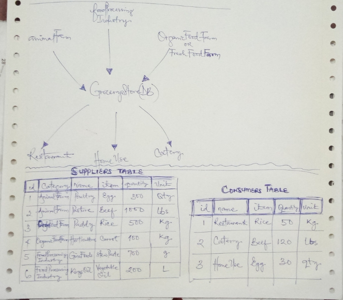
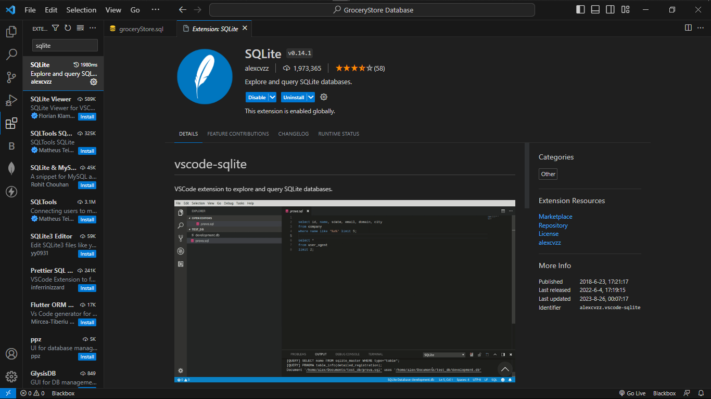

# GroceryStore Database

Welcome to the GroceryStore Database project! This SQLite database is designed to manage and store grocery store inventory data.

## File Structure

Here's the file structure of the project:

- **groceryStore.db**: The SQLite database file containing grocery store inventory data.
- **groceryStore.sql**: The SQL script used to create the database schema and initial data.
- **sandbox.txt**: A text file for experimenting with SQL queries and notes.
- **images**: Folder containing project-related images.

## Project Sketch

<div style="margin: 0 auto; width: 32vw; aspect-ratio: 2/1; display: grid; place-items: center;">
    
</div>

Above is a freehand sketch of the project layout.

## Sample Result in VSCode

<div style="margin: 0 auto; width: 54vw; aspect-ratio: 2/1; display: grid; place-items: center;">
    
</div>

This image showcases a sample result from querying the database in the VSCode text editor interface.

## SQLite Installation in VSCode

<div style="margin: 0 auto; width: 54vw; aspect-ratio: 2/1; display: grid; place-items: center;">
    
</div>

Here's an image displaying how to install the SQLite extension in VSCode for database management.

## SQL Queries

### Create Table Query
Click to Copy

```sql
CREATE TABLE suppliers_table (
  id INTEGER PRIMARY KEY AUTOINCREMENT,
  category TEXT NOT NULL,
  name TEXT NOT NULL,
  item TEXT NOT NULL,
  quantity INTEGER NOT NULL,
  unit TEXT NOT NULL
);
```

### Insert Data into Table Query
Click to Copy
```sql
INSERT INTO suppliers_table VALUES (1, 'Animal Farm', 'Poultry', 'Egg', 300, 'qty');

```

### Fetch Values From Table
Click to copy:
```sql
SELECT * FROM suppliers_table;
```

Feel free to customize this README.md script according to your project's specific details. You can replace the image file names and descriptions with your actual project images and descriptions.